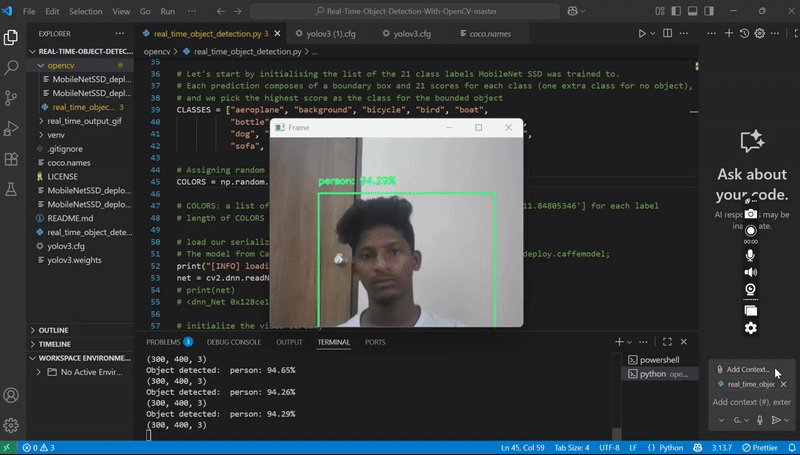

# Real-Time Object Detection with OpenCV

🚀 This project demonstrates **real-time object detection** using **OpenCV** and a pre-trained **MobileNetSSD model**.  
It detects common objects like people, cars, chairs, dogs, etc., directly from your webcam feed.  

---

## 📌 Features
- Real-time object detection with OpenCV
- Uses MobileNetSSD pre-trained model
- Supports multiple object classes
- Easy to run with Python

---

## ⚙️ Installation

1. Clone the repository:
   ```bash
   git clone https://github.com/shaikshandu/Real-Time-Object-Detection-With-OpenCV.git
   cd Real-Time-Object-Detection-With-OpenCV/opencv
``Install dependencies:
pip install opencv-python
``
▶️ Usage
Run the following command:
python real_time_object_detection.py --prototxt MobileNetSSD_deploy.prototxt.txt --model MobileNetSSD_deploy.caffemodel
This will start the webcam and perform real-time object detection.

🎥 Demo

output video---------
  

📜 License
This project is licensed under the MIT License.


👉 You just need to save this as **`README.md`** in your repo’s root folder.  
👉 Since you already have `real_time_output_gif/demo-gif.gif`, GitHub will display it automatically.  


Project Structure
```text
Real-Time-Object-Detection-With-OpenCV/
├── opencv/
├── MobileNetSSD_deploy.prototxt.txt
├── MobileNetSSD_deploy.caffemodel
├── real_time_object_detection.py
├── real_time_output_gif/
│   └── demo-gif.gif
├── coco.names
├── LICENSE
└── README.md

